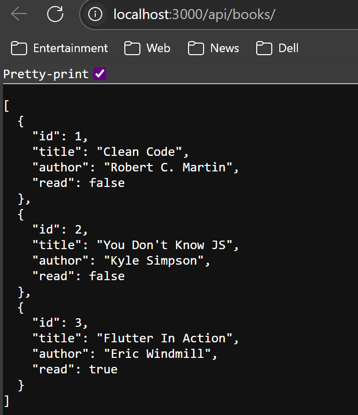

## ExpressJS Basics

--> Express is a fast and minimal web framework for Node.JS. It provides a set of features suitable for building web applications. With Express, you can: - Build Web applications including single-page & multi-page applications. - Build an API server.

#### Creating Express Hello World App:

1. First: Make sure you installed express in your folder:

```js
//in your terminal of your directory:
npm install express

//in the folders that were installed with exress, you'll find one named package.json, set the type to module, to force Node.JS to use ES modules:
{
	"type" : "module",
}
```

> [!NOTE] Bonus Tip
> For every time we edit our code --let's say our main file is called index.js-- we have to restart the server. So, instead, write the following code in your package.json to listen to any changes and auto refreshing without restarting the server everytime.

```js
//In your package.json in scripts type the following:
"scripts" : {
	"start" : "node --watch index.js"
},
//The --watch flag will restart the server whenever you change the source code. Just make sure to change the (index.js) for whatever main file you have.
//If you don’t add the `--watch` flag, you must restart the server whenever you change the code.

```

2.  Second: Let's create our main file named `index.js`:

```js
//import the `express` function from the `express` library
//In Common JS, we used to type [const express = require('express');] but now, we use the ES module for importing
import express from 'express';

//Next, call the `express()` function to get an instance of the `Express` app
const app = express();

//define a `PORT` constant that stores the port number for the server to listen on
const PORT = 3000;

//define a route handler that handles the HTTP GET request to the site route
app.get('/', (req, res) => {
	res.send('Hello, World! Yasmine talking 😎✌️.');
});

app.listen(PORT, () => {
	console.log(`Server is listening on port http://localhost:${PORT}/`);
});

//Now, run the following in your terminal
> npm start

// the server is running and listening on the port 3000. If you launch the page `http://localhost:3000/` on the web browser, you’ll see the `Hello, World! Yasmine talking 😎✌️.` message on the screen.
//Out: Server is listening on port http://localhost:3000/
//CTRL+C to exit

```

> [!NOTE] The functions `.listen()` and `.get()`
>
> 1.  `.get()` :
>
> - First parameter is the **_route_** (i.e. `'/'`)
> - Second parameter is _call back function_ with two parameters: `req ==> request` & `res ==> response` , this function is also known as **_Router Handler_**.
>
> 2. `.listen()` :
>
> - To instruct the app to listen to requests on the port `3000`

##### What if we wanted to return a JSON to the Client from the Express app, instead of the message popping up dirextly?

- You will do the same steps as before, but instead of our `res.send("Hello World");` we will change it to `res.send({message : 'Hellow World!' });` let's see the whole code again:

```js
import express from "express";

const app = express();

const PORT = 3000;

//instead of the last, we added the format of JSON file
app.get("/", (req, res) => {
  res.send({ message: "Hello, World! Yasmine talking 😎✌️." });
});

app.listen(PORT, () => {
  console.log(`Server is listening on port http://localhost:${PORT}/`);
});

//Out on our port:
//{"message":"Hello, World! Yasmine talking 😎✌️."}
```

#### Using REST Client on VS Code:

We can actually make HTTP requests and view the response directly within the editor, by:

1. Installing the REST extension in VS Code.
2. Create a file named `api.http` in your project directory and type the following:
   ]]

3. Now run your `index.js` file, then press on the (Send Request) that is shown through the errors in your `api.http` file to make the HTTP request. The following `Response` will appear:
   ]]

---

## Introduction to Express Routing:

--> An endpoint is a specific URL (_Uniform Resource Locator_) or path and an HTTP method (`GET`, `POST`, `PUT`)

--> Typically, an endpoint represents a specific resource or function which a client can perform such as fetching data, modifying data, and deleting records.
For example:

```js
//The following endpoint retrieves a list of todos:
GET / todos;
//In this endpoint, the path is "/todos", and the HTTP method is "GET"

//The following endpoint creates a new todo item:
POST / todos;
//Here the path is still "/todo", but the HTTP method is "POST"
```

--> In Express, routing is about setting up endpoints and defining how the app should respond when a client requests to those endpoints.
_ROUTE_ : defines how your app handles rquests to an endpoint.

```js
//To define a route
app.method(path, handler);
```

In this syntax:

- `app` is an instance of _Express_
- `method` is an HTTP request method in lowercase (i.e. `get`, `post`, `put`, `patch` and `delete`).
- `path` is the path on the server
- `handler` is a function that is executed when the route is matched. The route handler has access to the `req` & `res` objects, which correspod to HTTP request and response objects.

##### Basic Route Examples:

```js
//The following defines a route for the "GET" requests to the root URL '/':
app.get("/", (req, res) => {
  res.send("Hello, World! Yasmine talking 😎✌️.");
});

//Similarly, the following defines a route for the "GET" request to URL namely '/about':
app.get("/about", (req, res) => {
  res.send("About Page");
});

//The following example defines a route for "POST" requests to URL namely "/login":
app.post("/login", (req, res) => {
  res.send("Authenticated");
});
```

### Let's create an Express app with a couple of routes:

```js
//-------------- index.js file ------------------
import express form 'express';

const app = express();
const PORT = 3000;

app.listen(PORT, () => {
	console.log(`Server is listening on port http://localhost:${PORT}/`);
})
//now start the server by running
> node index.js
//out: Server is listening on port http://localhost:3000/

//Now, create a new file named books.js
//----------------- books.js ------------------
export const books = [
	{id: 1, title: 'Clean Code', author: 'Robert C. Martin', read: false},
	{id: 2, title: "You Don't Know JS", author: 'Kyle Simpson', read: false},
	{id: 3, title: 'Flutter In Action', author: 'Eric Windmill', read: true}
];

export const getNextBook = () => {
	let maxId = 1;
	books.forEach((book) => {
		if(book.id > maxId){
			maxId = book.id;
		}
	});
	return maxId + 1;
};
//---------- index.js ----------------
//add the imported books and getNextBook
import {books, getNextBook} from './books.js';
import express form 'express';

const app = express();
const PORT = 3000;

app.get('api/books/', (req, res) => {
	res.send(books);
});

app.listen(PORT, () => {
	console.log(`Server is listening on port http://localhost:${PORT}/`);
})

//Finally, modify your api.http and add your route
//-------------------- api.http --------------
GET http:/localhost:3000/api/books/

//This will actually give us an error when running the server on localhost 3000 and when you send the request on VS Code, it will work easily and the list will appear, but why?
//Simply because of this line:
app.listen(PORT, () => {
	console.log(`Server is listening on port http://localhost:${PORT}/`);
})
//You are listening to the changes made to the default route '3000/' where nothig happened, so you have to modify it to our new modified route:
app.listen(PORT, () => {
	console.log(`Server is listening on port http://localhost:${PORT}/api/books/`);
})

```

--> output from the reponse on REST:
]]

Now, our server will look like this:
]]

##### Let's add a condition in retrieving our list, instead of retrieving all the data in the list, let's just retreive the books that are already read:

> [!NOTE] Adding a query string to a route
> ->A query string is everything after the '?' sign in any route:
> [http://localhost:3000/api/books/?read=true]
> Here, the "read=true" is the query string.
> -> A query string may include one or more parameters, where each parameter is represented by a unique key/value pair separated by an equals sign ( `=` ).
> -> To acess the `read` parameter we can modify the console line to `console.log(req.query.read)`
> -> To access your query string from the URL in Express, we use the `req.query` object as shown:

```js
> app.get('/api/books/, (req, res) => {
> 	console.log(req.query);
> )}; //Out in the console: {read : 'false'}
```

---

## Introduction to Express MiddleWare:

--> A middleware is a function that has access to the followig objects:

- The request object ( `req` )
- The Response object ( `res` )
- The next middleware function ( `next` )

Technically, an Express application is a series of middleware function calls as shown:
]]

To define a middleware function:

```js
function fn(req, res, next) {
	...
	next();
}
//If you don't end the request/response cycle in the current middleware function, you MUST call the next() function to pass control to the next middleware function, or else, the request will be left hanging.
```

==To end the request/response cycle in a function, you need to send a response back to the client by using one of the following methods:==
a) `res.send()` : send a response body and end the request/response cycle.
b) `res.json` : send a JSON response and end the request/response cycle
c) `res.redirect` : redirect the client to another URL and ends the request/response cycle.
d) `res.end()` : ends the request/response cycle without sending any data.

##### -> Why do we use Middleware?

To:

- Change the request and response objects
- Terminate the request-response cycle
- Add custome logic to the request/response cycle such as validation, authentication and authorization
- Call the next middleware function

##### --> Express middleware types:

###### 1. Application-level middleware:

To bind this type of middleware to an instance of the Express object:

```js
//------------- index.js ---------------
import express form 'express';
const app = express();

//Define middleware:
const middleware = (req, res, next) {
	console.log("Execute middleware");
	next();
}
//First method to use middleware
app.use(middleware);

//Second method, pass middleware function to the app.METHOD() function, whatever method you have:
app.get('/', middleware, (req, res) => {
	//route handler
});
```

Let's see a whole example using middleware:

```js
import express from "express";
const app = express();
const PORT = 3000;

const timerMiddleware = (req, res, next) => {
  const start = Date.now();
  res.on("finish", () => {
    const duration = Date.now() - start;
    console.log(`${req.method} ${req.url} - ${duration} ms`);
  });
  next();
};
//To register the Middleware, this will attach your `timerMiddleware` to **all routes**. It’ll run on every request.
app.use(timerMiddleware);

app.get("/", (req, res) => {
  res.send("📘 Welcome to the Book API");
});

app.get("/contact", (req, res) => {
  res.send("📞 Contact us at contact@example.com");
});

app.listen(PORT, () => {
  console.log(`🚀 Server is running on http://localhost:${PORT}`);
});
/*
OUT:
	🚀 Server is running on http://localhost:3000
	GET / - 5 ms
	GET / - 2 ms
	GET / - 1 ms
	GET / - 1 ms
	GET / - 0 ms
*/
//The output shows how quickly Express processed each request. The times vary slightly depending on system load and network.
```

_timerMiddleware :_

- This middleware runs before any route handler
- It logs the method, URL and how long the request took from start to finish.
  -- `req.method` : like `GET`, `POST`, etc.
  -- `req.url` : like `/` , `/contact`
  -- `res.on('finish', ...)` : waits until the response is fully sent.
  -- Then it calculates how many milliseconds passed since the request started.

###### 2. Router-level Middleware:

It's an application-level middleware, except it is bound to the _Router_ instance instaed of the Express (app) instance.

###### 3. Built-In Middleware:

- `express.json` middleware allows you to parse the requests with the JSON body.
- `express.static` middleware serves static assets such as HTML files, images, etc.
- `express.urlencoded` parses the requests with a URL-encoded body.

###### 4. Third-Party Middleware:

These allow you to enhance the functionality of the Express apps, they require installation via package managers as npm.

###### 5. Error-Handling Middleware:

Unlike a reguler middleware, an error-handling middleware takes four parameters instead of three:

```js
function fn(err, req, res, next) {
	...
	next();
}
//The first argument of an error-handling middleware is the "error" object.
```

##### Quick summary about Middleware:

- A middleware is a function that has access to the request, response, and the next middleware function.
- Use the `app.use()` function to register a middleware.
- Register the middleware before particular router handlers to apply the middleware to these route handlers.

---
