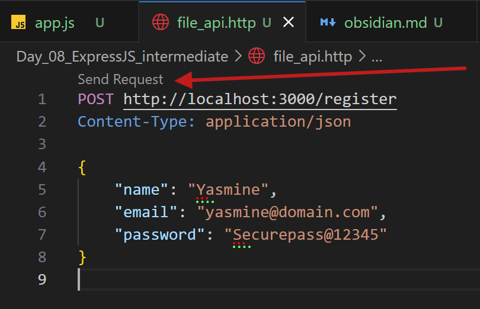
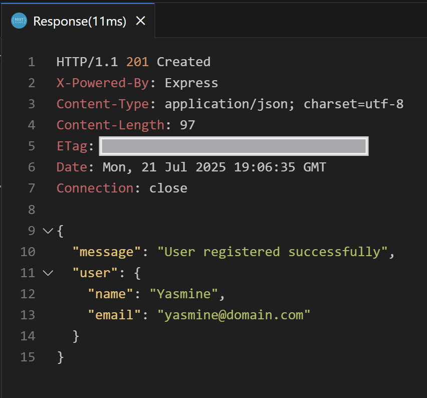
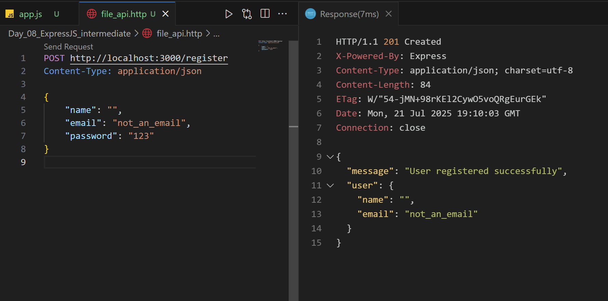
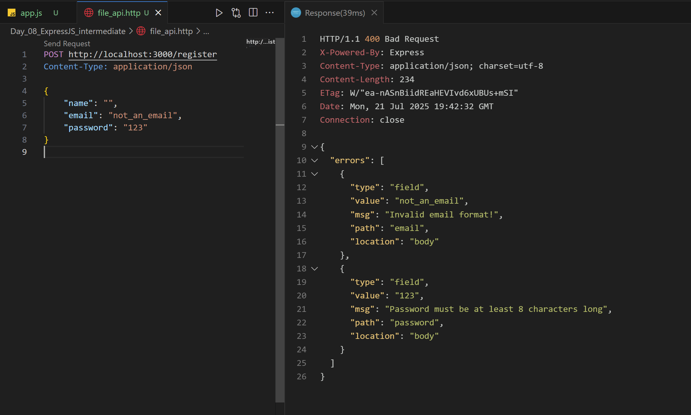
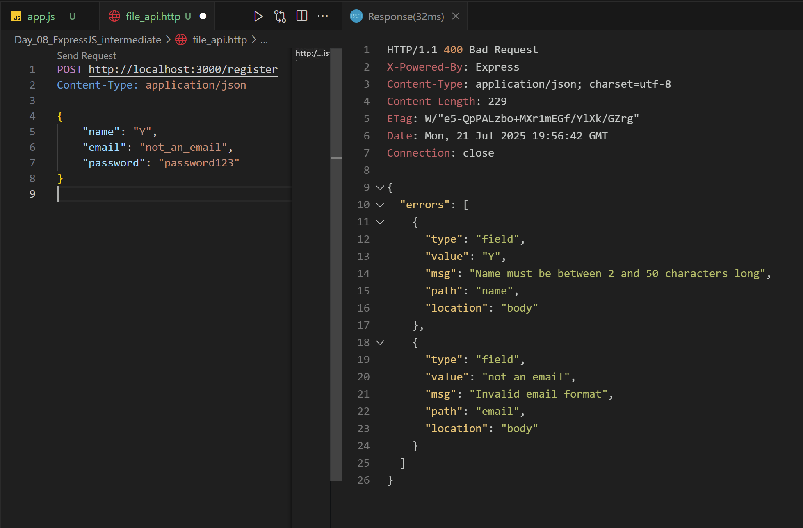
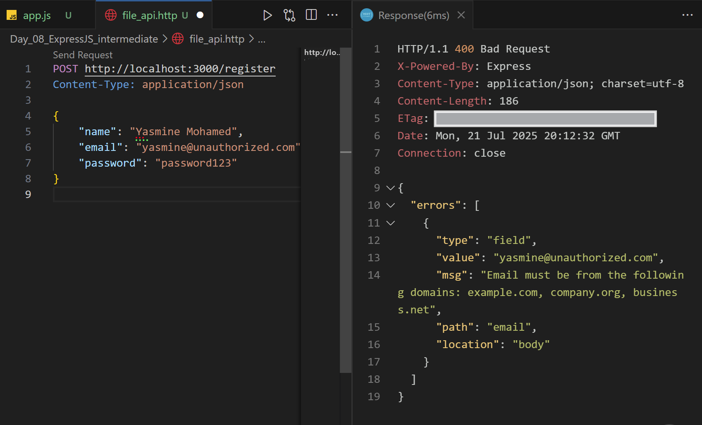
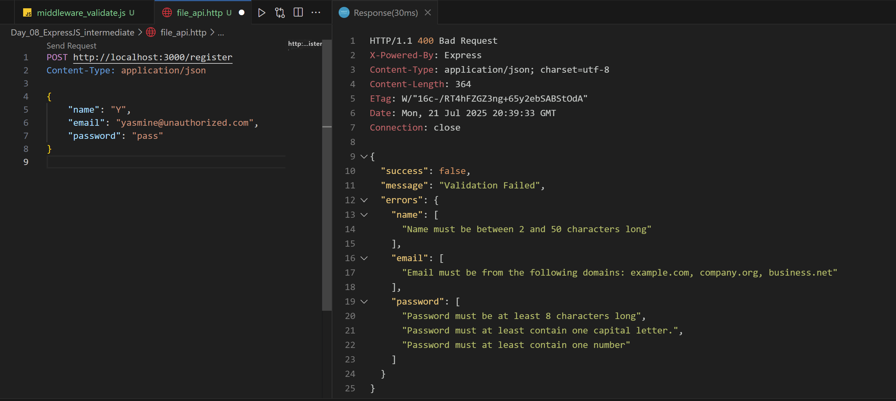

## ExpressJS Intermediate

## Using Express-Validator for Data Validation:

First, we have to install the `Express-validator` package the same way we have installed `Express` before:

```js
> npm install express-validator
```

Now, let's first build an Express app WITHOUT validation:

```js
//--------------- app.js ----------------
import express from "express";
const app = express();

const PORT = 3000;

app.use(express.json());

app.get("/", (req, res) => {
  res.send("Welcome to the Validation Demo!");
});

app.post("/register", (req, res) => {
  const { name, email, password } = req.body;
  const user = { name, email, password };
  res.status(201).json({
    message: "User registered successfully",
    user: { name, email },
  });
});

app.listen(PORT, () => {
  console.log(`Server is running on http://localhost:${PORT}/`);
});
```

##### Let's exaplain the new code lines:

1. `app.use(express.json)` : This line is a middleware that tells _Express_ to automatically parse incoming JSON requests.
   - Without this, `req.body` will be indefined
   - It's essential when working with APIs that expect JSON payloads, like user registration
2. `app.post('/register', (req, res) => {...})` : A _POST_ route for user registration where:
   - `const {name, email, password} = req.body` :
     - We are using a technique namely _Destructuring_ to pull values from the incoming JSON body.
     - This means that the client must send data like the follwoing:
     ```js
     {
     	"name": "Yasmine",
     	"email": "yasmine@domain.com",
     	"password": "Securepass@123"
     }
     ```

````
	- `const user = {name, email, password};` :
		- You are grouping the extracted info into a _user object_ which is useful for saving to a database or logging in the future.
	- `res.status(201).json({})` :
		- This sends a _JSON response_ with HTTP status 201 (Created).
		- Confirms successful registration

Now, let's continue with our app, let's send a _Valid request_ using POSTMAN, or _REST CLIENT_ we installed last time:
```js
//---------------- file_api.http -------------------
POST http://localhost:3000/register
Content-Type: "application/json"

{
	"name": "Yasmine",
	"email": "Yasmine@domain.com",
	"password": "Securepass@12345"
}

````

Now, click the send request as shown pointed red arrow below:
]]

When you do, you will find the following response:
]]

###### Everything looks good till ow, right? So, what is the usage of the package we preinstalled named `Express_validator` ?

Well, let's try sending an _Invalid_ request as the following:
]]

--> What happened here?

1. Even though we didn't enter a value in name we had a message saying "User registered successfully"
2. The email is not a valid format email yet was accepted and stored
3. password should have several rules, as having at least one number, one capital letter and a special character, yet we stored it as a _valid_ password
   Of course this is not clean at all, you are literally storing rubbish invalid data that was entered, and here comes the reason we will use `express_validator` to validate the data the user entered before saving it or using it in the future.

### We will be using `Express_Validator` to _prevent_ the following scenarios:

1. Accepting missing or empty required fields
2. Not detecting improperly formatted email addresses
3. Allowing short, insecure passwords
4. Accepting malicious inouts, leading to security vulnerabilities
5. Storing invalid and inconsistent data in the database

--> Now, let's enhance our pre-made application with basic validation, I will comment the old code and write the new code for validation:

```js
//---------------- app.js --------------

//import express from "express";
import { body, validationResult } from "express-validator";
//const app = express();
//const PORT = 3000;

//app.use(express.json());

//app.get("/", (req, res) => {
//  res.send("Welcome to the Validation Demo!");
//});

app.post(
  "/register",
  [
    body("name").notEmpty().withMessage("Name is required!"),
    body("email").isEmail().withMessage("Invalid Email address"),
    body("password")
      .isLength({ min: 8 })
      .withMessage("Password must be at least 8 characters long!"),
  ],
  (req, res) => {
    const errors = validationResult(req);
    if (!errors.isEmpty()) {
      return res.status(400).json({ errors: errors.array() });
    }
    //  const { name, email, password } = req.body;
    //  const user = { name, email, password };
    //  res.status(201).json({
    //    message: "User registered successfully",
    //    user: { name, email },
    //  });
  }
);

//app.listen(PORT, () => {
//  console.log(`Server is running on //http://localhost:${PORT}/`);
//});
```

Now, when we send the same _Invalid inputs_ we sent before, you will get the following response:
]]

Now that was our most basic validation, let's make a more sophisticated registration validation than the last bacsic one:

```js
[
  //Validating name field
  body("name")
    .notEmpty()
    .withMessage("Name is required")
    .trim()
    .isLength({ min: 2, max: 50 })
    .withMessage("Name must be between 2 and 50 characters long"),

  //Validating email field
  body("email")
    .notEmpty()
    .withMessage("Email is required")
    .isEmail()
    .withMessage("Invalid email format")
    .normalizeEmail(),

  //Validating password field
  body("password")
    .notEmpty()
    .withMessage("Password is required")
    .isLength({ min: 8 })
    .withMessage("Password must be at least 8 characters long"),
];
```

]]

Even though most of the validator comes with a lot of built-n validators, you can still customize your own, let's see here how we can restrict the incoming emails to only those with allowed domains:

```js
[
  body("email")
    .notEmpty()
    .withMessage("Email required")
    .isEmail()
    .withMessage("Invalid email format")
    .custom((value) => {
      const allowedDomains = ["example.com", "company.org", "business.net"];
      const domain = value.split("@")[1];
      if (!allowedDomains.includes(domain)) {
        throw new Error(
          `Email must be from one of these domains: ${allowedDomains.join(
            ", "
          )}`
        );
      }
      return true;
    })
    .normalizeEmail(),
];
```

]]

Let's play a little more validation on the password field:

```js
[
  body("password")
    .notEmpty()
    .withMessage("Password required")
    .isLength({ min: 8 })
    .withMessage("Password must be at least 8 characters long")
    .matches(/[A-Z]/)
    .withMessage("Password must at least contain one capital letter.")
    .matches(/[0-9]/)
    .withMessage("Password must at least contain one number"),
];
```

Till now the error messages that result in the response are somehow not user friendly, let's make them less messy and format these error messages a little by packing them with the field the are related to as shown:

```js
//----------- middleware_validation.js ----------
import {validationResult} from "express-validator";

export const validate = (req, res) => {
	const errors = validationResult(req);
	if(!errors.isEmpty()){
		const formattedErrors = {};
		errors.array().forEach(error => {
			if(!formattedErrors[error.path]){
				formattedErrors[error.path] = [];
			}
			formattedErrors[error.path].push(error.msg);
		});
		return res.status(400).json({
			success: false,
			message: "Validation Failed",
			errors: formattedErrors
		});
	}
	next();
};

//---------- app.js -------------
import {validate} from "/middleware_validation.js";

//....
//after the [body("field")], we will call the validate function
, validate, (req, res) => {...}
```

Now it looks more cleaner...

]]

---
